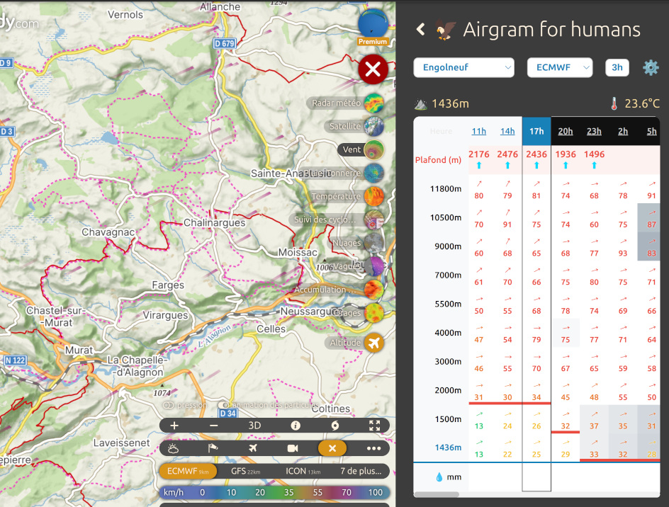
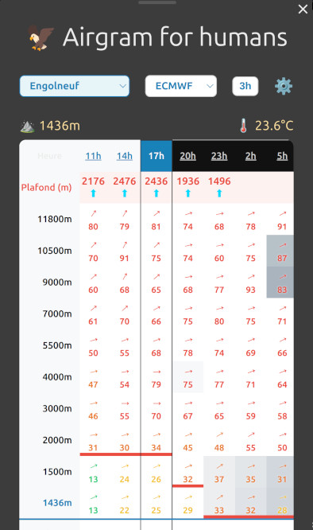
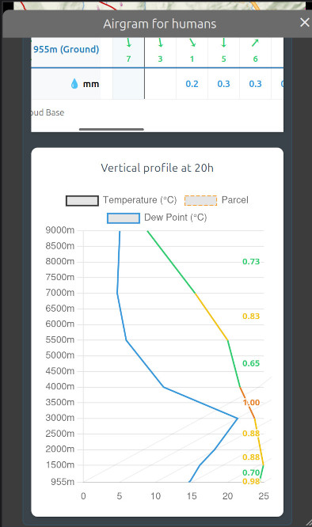

# Airgram for Humans 🦅

A lightweight Windy plugin designed to help you quickly inspect wind and thermal conditions for flight planning. It combines a wind profile table, cloud-base information, and a vertical emagram view in one place.

## Instalation (Windy private disctribution)

In Windy select Menu then Install plugin and choose Load plugin from URL.

Enter following URL plugin:

https://windy-plugins.com/4142422/windy-plugin-my-airgram/0.0.2/plugin.min.js

## ✨ What this plugin does

- Displays a forecast grid for several atmospheric levels
- Highlights thermal ceilings and cloud-base zones
- Includes a vertical profile chart for a selected time step

## 🧭 How to use it

1. Open the plugin from the Windy interface.
2. Pick a location on the map or select a favorite.
3. Choose a forecast model.
4. Explore the wind table and the vertical profile for the selected hour.

## 📝 Notes

This plugin is intended for weather visualization and planning support. It is not a replacement for official aviation briefing tools.

## Licence

This project is licensed under the **MIT License** - see the [LICENSE](LICENSE) file for details.

## Screenshots

### Computer

### Mobile

